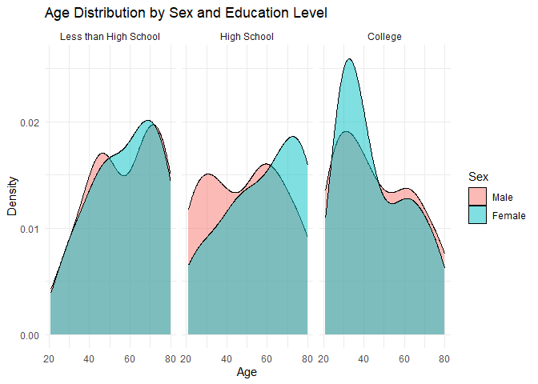
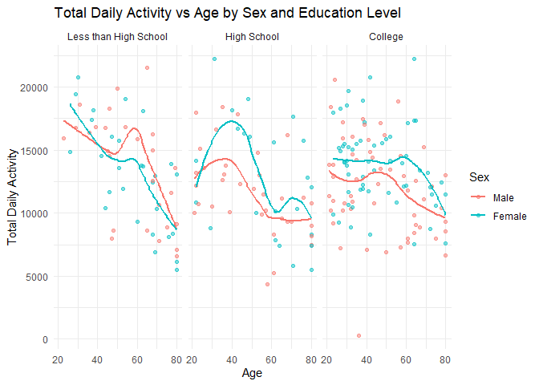
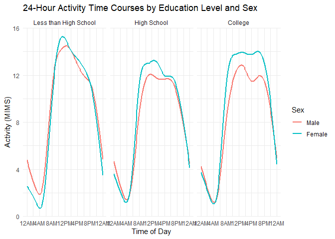
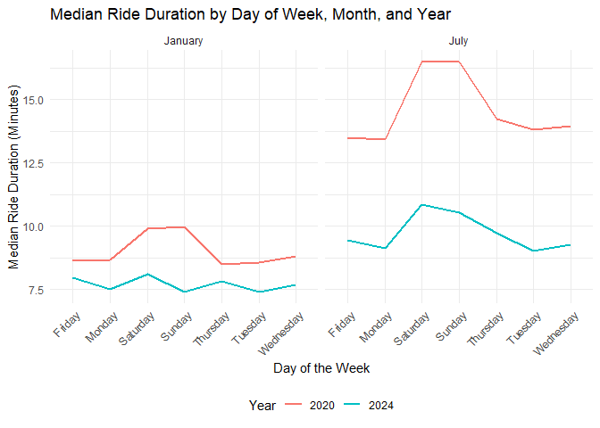
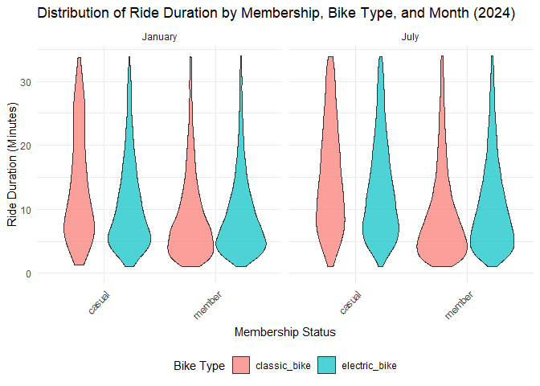

p8105_hw3_fl2714
================
Fangchi
2024-10-10

``` r
library(tidyverse)
```

    ## ── Attaching core tidyverse packages ──────────────────────── tidyverse 2.0.0 ──
    ## ✔ dplyr     1.1.4     ✔ readr     2.1.5
    ## ✔ forcats   1.0.0     ✔ stringr   1.5.1
    ## ✔ ggplot2   3.5.1     ✔ tibble    3.2.1
    ## ✔ lubridate 1.9.3     ✔ tidyr     1.3.1
    ## ✔ purrr     1.0.2     
    ## ── Conflicts ────────────────────────────────────────── tidyverse_conflicts() ──
    ## ✖ dplyr::filter() masks stats::filter()
    ## ✖ dplyr::lag()    masks stats::lag()
    ## ℹ Use the conflicted package (<http://conflicted.r-lib.org/>) to force all conflicts to become errors

``` r
library(readxl)
library(janitor)
```

    ## 
    ## 载入程序包：'janitor'
    ## 
    ## The following objects are masked from 'package:stats':
    ## 
    ##     chisq.test, fisher.test

``` r
library(lubridate)
library(knitr)
library(dplyr)
```

## Problem 2 - NHANES Accelerometer Data

``` r
demographics_df <- 
  read_csv("data/nhanes_covar.csv",skip = 4) |> 
  janitor::clean_names() |>
  filter(age >= 21, !is.na(education), !is.na(sex)) 
```

    ## Rows: 250 Columns: 5
    ## ── Column specification ────────────────────────────────────────────────────────
    ## Delimiter: ","
    ## dbl (5): SEQN, sex, age, BMI, education
    ## 
    ## ℹ Use `spec()` to retrieve the full column specification for this data.
    ## ℹ Specify the column types or set `show_col_types = FALSE` to quiet this message.

``` r
accelerometer_df <- 
  read_csv("data/nhanes_accel.csv") |>
  janitor::clean_names()
```

    ## Rows: 250 Columns: 1441
    ## ── Column specification ────────────────────────────────────────────────────────
    ## Delimiter: ","
    ## dbl (1441): SEQN, min1, min2, min3, min4, min5, min6, min7, min8, min9, min1...
    ## 
    ## ℹ Use `spec()` to retrieve the full column specification for this data.
    ## ℹ Specify the column types or set `show_col_types = FALSE` to quiet this message.

``` r
# Join the demographic and accelerometer datasets by participant ID
final_data <- 
  left_join(accelerometer_df, demographics_df, by = "seqn") |>
  drop_na()
```

``` r
# Encode variables with appropriate data types
final_data <- final_data %>%
  mutate(
    education = factor(education, levels = 1:3, labels = c("Less than High School", "High School", "College")),
    sex = factor(sex, levels = c(1, 2), labels = c("Male", "Female"))
  )
```

``` r
# Table of men and women in each education category
education_sex_table <- final_data %>%
  group_by(education, sex) %>%
  summarise(count = n(), .groups = "drop") %>%
  pivot_wider(names_from = sex, values_from = count) %>%
  mutate(Total = Male + Female)

# Display the table using knitr
knitr::kable(education_sex_table, caption = "Number of Men and Women in Each Education Category")
```

| education             | Male | Female | Total |
|:----------------------|-----:|-------:|------:|
| Less than High School |   27 |     28 |    55 |
| High School           |   35 |     23 |    58 |
| College               |   56 |     59 |   115 |

Number of Men and Women in Each Education Category

``` r
# Plot age distribution by sex and education level
ggplot(final_data, aes(x = age, fill = sex)) +
  geom_density(alpha = 0.5) +
  facet_wrap(~ education) +
  labs(title = "Age Distribution by Sex and Education Level",
       x = "Age", y = "Density",
       fill = "Sex") +
  theme_minimal()
```

<!-- -->
\### Observations

- **Age Distribution**: Age distributions vary across education levels,
  with a higher concentration of younger participants in the **College**
  group and older participants in the **Less than High School** and
  **High School** groups.
- **Sex Differences**: For **College**-educated individuals, there is a
  slight female predominance across most age ranges, while the **Less
  than High School** and **High School** groups show a more balanced or
  slightly male-dominant distribution.
- **Peak Ages**: The **College** group has a noticeable peak in the
  20–30 age range, reflecting a younger demographic, whereas **Less than
  High School** and **High School** groups have peaks around 60 years,
  indicating an older demographic for those with lower education levels.

``` r
# Calculate total daily activity for each participant
final_data <- final_data %>%
  mutate(total_activity = rowSums(select(final_data, starts_with("min"))))

# Plot total activity vs. age by sex and education level
ggplot(final_data, aes(x = age, y = total_activity, color = sex)) +
  geom_point(alpha = 0.5) +
  geom_smooth(method = "loess", se = FALSE) +
  facet_wrap(~ education) +
  labs(title = "Total Daily Activity vs Age by Sex and Education Level",
       x = "Age", y = "Total Daily Activity",
       color = "Sex") +
  theme_minimal()
```

    ## `geom_smooth()` using formula = 'y ~ x'

<!-- -->

### Observations

- **Age and Total Activity**: Total activity levels vary by age, with a
  tendency to decrease among older participants.
- **Sex Differences**: Men generally show slightly higher activity
  levels than women across most age groups.
- **Education Levels**: The patterns of activity by age are similar
  across education levels, though college-educated participants show
  slightly higher activity overall, possibly reflecting lifestyle
  differences.
- **Trend**: The smooth trend line illustrates a gradual decline in
  activity with age for both men and women.

``` r
# Reshape to long format for minute-by-minute activity
activity_long <- final_data %>%
  pivot_longer(cols = starts_with("min"), 
               names_to = "minute", 
               values_to = "activity") %>%
  mutate(minute = as.numeric(str_remove(minute, "min")))

# Plot 24-hour activity patterns
ggplot(activity_long, aes(x = minute, y = activity, color = sex)) +
  geom_smooth(se = FALSE) +
  facet_wrap(~ education) +
  scale_x_continuous(breaks = seq(0, 1440, 240),
                     labels = c("12AM", "4AM", "8AM", "12PM", "4PM", "8PM", "12AM")) +
  labs(title = "24-Hour Activity Time Courses by Education Level and Sex",
       x = "Time of Day", y = "Activity (MIMS)",
       color = "Sex") +
  theme_minimal()
```

    ## `geom_smooth()` using method = 'gam' and formula = 'y ~ s(x, bs = "cs")'

<!-- -->

### Observations

- **Daily Activity Peaks**: All show two main peaks in activity — one in
  the morning around 8 AM and another in the evening around 6 PM.

- **Differences by Education Level**:

  - **Less than High School** and **College** groups have a more
    pronounced morning peak than the **High School** group. The
    **College** group maintains slightly higher activity levels
    throughout the day, while the **Less than High School** and **High
    School** groups have lower midday activity.

- **Sex Differences**:

  - Across all education levels, women show slightly higher morning
    activity peaks than men.

## Problem 3 - Citi Bike

``` r
Jan_2020_df <- read_csv("data/citibike/Jan 2020 Citi.csv", show_col_types = FALSE) %>%
  janitor::clean_names() %>%
  mutate(year = 2020, month = "January")  

Jul_2020_df <- read_csv("data/citibike/July 2020 Citi.csv", show_col_types = FALSE) %>%
  janitor::clean_names() %>%
  mutate(year = 2020, month = "July")

Jan_2024_df <- read_csv("data/citibike/Jan 2024 Citi.csv", show_col_types = FALSE) %>%
  janitor::clean_names() %>%
  mutate(year = 2024, month = "January")

Jul_2024_df <- read_csv("data/citibike/July 2024 Citi.csv", show_col_types = FALSE) %>%
  janitor::clean_names() %>%
  mutate(year = 2024, month = "July")

# merge all data
all_months_df <- bind_rows(Jan_2020_df, Jul_2020_df, Jan_2024_df, Jul_2024_df)

# summarize 
ride_summary <- all_months_df %>%
  group_by(year, month, member_casual) %>%
  summarise(total_rides = n(), .groups = 'drop') %>%
  pivot_wider(names_from = member_casual, values_from = total_rides, values_fill = 0)

# view results
kable(ride_summary, caption = "Total Number of Rides by Year, Month, and Rider Type (Casual and Member)")
```

| year | month   | casual | member |
|-----:|:--------|-------:|-------:|
| 2020 | January |    984 |  11436 |
| 2020 | July    |   5637 |  15411 |
| 2024 | January |   2108 |  16753 |
| 2024 | July    |  10894 |  36262 |

Total Number of Rides by Year, Month, and Rider Type (Casual and Member)

### Observations

- **Increase in Total Rides**:  
  Both **casual** and **member** rides increased significantly from 2020
  to 2024.

- **Seasonal Variation**:  
  For both years, **July** has a much higher ride count than
  **January**.

- **Casual vs. Member Rides**:

  - **Members** consistently have higher ride counts than casual users
    in each month and year. The number of rides from memeber
    continuously increased.
  - The increase in casual rides from **January** to **July** is more
    pronounced, which suggests that casual users may be more motivated
    by leisure or seasonal factors, while members have a relatively
    stable and predictable usage pattern.

``` r
top_stations_jul2024 <- Jul_2024_df %>%
  group_by(start_station_name) %>%
  summarise(total_rides = n(), .groups = 'drop') %>%
  arrange(desc(total_rides)) %>%
  slice_head(n = 5)  

kable(top_stations_jul2024, 
      col.names = c("Starting Station", "Number of Rides"), 
      caption = "Top 5 Most Popular Starting Stations in July 2024")
```

| Starting Station         | Number of Rides |
|:-------------------------|----------------:|
| Pier 61 at Chelsea Piers |             163 |
| University Pl & E 14 St  |             155 |
| W 21 St & 6 Ave          |             152 |
| West St & Chambers St    |             150 |
| W 31 St & 7 Ave          |             146 |

Top 5 Most Popular Starting Stations in July 2024

``` r
median_duration_df <- all_months_df %>%
  group_by(year, month, weekdays) %>%
  summarise(median_duration = median(duration, na.rm = TRUE), .groups = 'drop')

ggplot(median_duration_df, aes(x = weekdays, y = median_duration, color = factor(year))) +
  geom_line(aes(group = year), size = 1) +
  facet_wrap(~ month, ncol = 3) +
  labs(title = "Median Ride Duration by Day of Week, Month, and Year",
       x = "Day of the Week",
       y = "Median Ride Duration (Minutes)",
       color = "Year") +
  theme_minimal() +
  theme(
    legend.position = "bottom",
    axis.text.x = element_text(angle = 45, hjust = 1)  
  )
```

    ## Warning: Using `size` aesthetic for lines was deprecated in ggplot2 3.4.0.
    ## ℹ Please use `linewidth` instead.
    ## This warning is displayed once every 8 hours.
    ## Call `lifecycle::last_lifecycle_warnings()` to see where this warning was
    ## generated.

<!-- -->

### Observations

- **Seasonal Variation**:  
  Ride durations are generally higher in **July** than in **January**
  for both 2020 and 2024, likely due to increased recreational use
  during summer.

- **Yearly Differences**:  
  In 2020, **July** shows a sharp peak in ride duration on weekends,
  exceeding 15 minutes. In 2024, weekend durations are still higher but
  less pronounced, suggesting a shift towards shorter trips.

- **Weekday Patterns**:  
  Weekdays consistently show shorter ride durations, likely reflecting
  commuter usage, while weekends have longer durations, indicating more
  recreational rides.

``` r
data_2024 <- all_months_df %>%
  filter(year == 2024)

ggplot(data_2024, aes(x = member_casual, y = duration, fill = rideable_type)) +
  geom_violin(alpha = 0.7) +
  facet_wrap(~ month, ncol = 2) +
  scale_y_continuous(limits = c(0, quantile(data_2024$duration, 0.95)),  
                     name = "Ride Duration (Minutes)") +
  labs(
    title = "Distribution of Ride Duration by Membership, Bike Type, and Month (2024)",
    x = "Membership Status",
    fill = "Bike Type"
  ) +
  theme_minimal() +
  theme(
    axis.text.x = element_text(angle = 45, hjust = 1),
    legend.position = "bottom"
  )
```

    ## Warning: Removed 3301 rows containing non-finite outside the scale range
    ## (`stat_ydensity()`).

<!-- -->
\### Observations

- **Electric vs. Classic Bikes**:  
  Electric bikes tend to have shorter ride durations than classic bikes,
  likely due to faster speeds allowing quicker trips.

- **Membership Differences**:  
  Casual riders show longer ride durations, especially on classic bikes,
  indicating more recreational use. Members generally have shorter, more
  consistent durations, suggesting commuting use.

- **Seasonal Variation**:  
  In **July**, ride durations are longer for both casual and member
  users, reflecting increased recreational use in warmer months.
